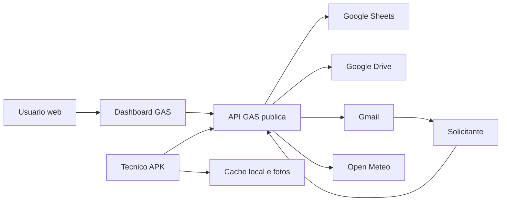

# Controle Telhado Threat Model

## Executive summary

O principal risco atual e a exposicao anonima de dados operacionais pela rota
legada `GET ?action=chamados`. A leitura foi confirmada no deployment publico:
sem login, a API retornou chamados, locais, descricoes, prioridades, status,
identificadores internos e nome de tecnico. Como o Web App precisa continuar
publico para o APK e para validacoes pos-chuva, a prioridade e remover ou
autenticar rotas publicas desnecessarias, limitar tentativas de login mobile e
endurecer upload, tokens e links com efeito colateral.

Status: o hardening correspondente foi publicado no deployment publico como
versao `82`. A rota legada foi testada novamente e passou a responder
`ROTA_NAO_ENCONTRADA`, sem expor os chamados.

## Scope and assumptions

Em escopo:

- `gas/src/`: API, dashboard, autenticacao, Drive, Sheets, Gmail e clima.
- `gas/appsscript.json`: modelo de publicacao do Web App.
- `app/lib/`: login, sessao local, fila offline e chamadas HTTP Flutter.
- `app/android/app/src/main/AndroidManifest.xml`: permissoes mobile.
- `docs/contrato-api.md`: contrato esperado da API.

Fora de escopo:

- Configuracao administrativa real do Google Workspace e permissoes efetivas
  da pasta do Drive.
- Seguranca fisica e MDM dos celulares.
- Processo CI/CD externo, pois nao ha pipeline versionado no repositorio.
- Futuro servidor proprio com IA.

Premissas adotadas por falta de detalhamento:

- O deployment `ANYONE_ANONYMOUS` e necessario para o APK e links pos-chuva.
- O dashboard deve ser acessado somente por usuarios institucionais `@uel.br`.
- Chamados, locais, fotos, GPS e nomes de tecnicos sao dados internos da UEL.
- Celulares podem ser pessoais, institucionais ou mistos; perda do aparelho e
  um risco real.
- A pasta de fotos deve ser privada para equipe autorizada. Se estiver
  compartilhada por link, o risco de exposicao aumenta.
- Nao existe proxy, WAF ou rate limiting externo na frente do GAS.
- Links pos-chuva sem login sao aceitaveis como decisao de produto, desde que
  tenham token forte, uso unico e expiracao.

Questoes abertas que alteram a classificacao:

- Os aparelhos tecnicos sao controlados por MDM?
- Qual e a politica real de compartilhamento da pasta raiz do Drive?
- Existem controles Google Workspace adicionais para restringir acesso ao Web
  App ou alertar abuso?

## System model

### Primary components

- Dashboard Web: HTML Service servido pelo GAS e RPC via `google.script.run`.
- API HTTP GAS: `doGet`, `doPost`, `handleGet` e `handlePost`.
- App Flutter: login tecnico, cache SQLite, sessao local, fotos e sync offline.
- Google Sheets: estado operacional, usuarios, tecnicos, tokens e logs.
- Google Drive: armazenamento de fotos.
- Gmail: envio de validacoes pos-chuva.
- Open-Meteo: previsao e chuva observada.

Evidence anchors:

- `gas/src/main.gs`: `doGet`, `doPost`, `renderWebApp_`.
- `gas/src/api.gs`: `handleGet`, `handlePost`.
- `gas/src/index.html`: `callServer`.
- `app/lib/services/sync_service.dart`: `SyncService`.
- `gas/src/config.gs`: `CONFIG`.

### Data flows and trust boundaries

- Internet -> GAS Web App: HTTP GET/POST publico; recebe JSON, query params,
  login/senha mobile, tokens, fotos base64 e respostas pos-chuva. TLS e
  fornecido pelo Google, mas nao ha rate limit implementado no repositorio.
- Dashboard -> funcoes GAS: RPC `google.script.run`; autenticacao web depende
  de `Session.getActiveUser().getEmail()` e autorizacao em Sheets.
- APK -> API GAS: POST JSON `action + payload`; login tecnico gera token UUID e
  operacoes seguintes validam token e tecnico atribuido ao chamado.
- GAS -> Sheets: leitura e escrita privilegiada executada como usuario que
  implantou o script.
- GAS -> Drive: criacao de arquivos a partir de base64 enviado pelo APK.
- GAS -> Gmail -> solicitante -> GAS: e-mail inclui link GET com token para
  registrar resposta pos-chuva e, em caso negativo, abrir reincidencia.
- GAS -> Open-Meteo: chamada HTTP para endpoint fixo de previsao.
- APK -> armazenamento local: token em SharedPreferences, fila SQLite e fotos
  pendentes em diretorio local do app.

Evidence anchors:

- `gas/appsscript.json`: `executeAs: USER_DEPLOYING`, `access: ANYONE_ANONYMOUS`.
- `gas/src/auth.gs`: `getCurrentUserEmail_`, `getAuthorizedUserFromPayload_`.
- `gas/src/tecnicos.gs`: `loginTecnicoMobile`, `findTecnicoRowByToken_`.
- `gas/src/drive.gs`: `salvarFoto`.
- `gas/src/email.gs`: `enviarEmailValidacaoPosChuva_`,
  `responderValidacaoPosChuva`.
- `app/lib/services/auth_cache_service.dart`: `salvarSessaoDiaria`.

#### Diagram

## Assets and security objectives

| Asset | Why it matters | Security objective (C/I/A) |
|---|---|---|
| Chamados e locais | Descricoes podem revelar predios, salas e incidentes internos | C/I/A |
| Fotos de vistoria e conclusao | Podem mostrar infraestrutura interna | C/I |
| GPS dos tecnicos | Dados de localizacao potencialmente sensiveis | C/I |
| Senhas e tokens mobile | Permitem atuar como tecnico e modificar chamados | C/I |
| Perfis admin e usuarios aprovados | Controlam triagem, tecnicos e acessos | I |
| Historico e logs | Evidencia operacional e auditoria | I/A |
| Planilha operacional | Banco central do sistema atual | C/I/A |
| Conta implantadora GAS | Executa com acesso a Sheets, Drive e Gmail | C/I/A |
| Cotas GAS, Drive e Gmail | Recursos limitados sujeitos a abuso | A |

## Attacker model

### Capabilities

- Atacante remoto anonimo conhece ou descobre a URL publica do Web App.
- Pode enviar GET e POST arbitrarios, repetir requests e manipular payload JSON.
- Pode tentar enumerar logins tecnicos e realizar brute force.
- Pode obter um token mobile por comprometimento de aparelho, malware ou
  exposicao local e reutiliza-lo enquanto valido.
- Pode receber, encaminhar ou capturar um link pos-chuva.

### Non-capabilities

- Nao se assume acesso direto a Sheets, Drive ou conta implantadora.
- Nao se assume capacidade de alterar o APK distribuido oficialmente.
- Nao se assume quebra de TLS do Google.
- Nao se assume conhecimento previo de tokens UUID aleatorios.

## Entry points and attack surfaces

| Surface | How reached | Trust boundary | Notes | Evidence (repo path / symbol) |
|---|---|---|---|---|
| `GET action=chamados` | Internet anonima | Internet -> GAS | Confirmado: retorna chamados sem login | `gas/src/api.gs: handleGet` |
| Dashboard HTML | Internet anonima | Internet -> GAS | Servido publicamente; operacoes web dependem de sessao Google | `gas/src/main.gs: renderWebApp_` |
| API POST mobile | Internet anonima | APK/Internet -> GAS | Dispatcher por `action` | `gas/src/api.gs: handlePost` |
| Login tecnico | POST publico | Internet -> GAS | Sem rate limit ou lockout visivel | `gas/src/tecnicos.gs: loginTecnicoMobile` |
| Upload foto | POST com token | APK -> GAS -> Drive | Base64 e MIME controlados pelo cliente | `gas/src/drive.gs: salvarFoto` |
| Resposta pos-chuva | Link GET com token | E-mail/Internet -> GAS | GET altera estado e pode criar reincidencia | `gas/src/email.gs: responderValidacaoPosChuva` |
| RPC dashboard | `google.script.run` | Browser -> GAS | Funcoes criticas verificam admin no servidor | `gas/src/index.html: callServer` |
| Sessao local mobile | Armazenamento do app | Aparelho -> APK | Token fica salvo por ate 7 dias | `app/lib/services/auth_cache_service.dart` |
| Fila offline | SQLite e arquivos locais | Aparelho -> APK -> GAS | Reenvia payload e fotos ao reconectar | `app/lib/services/sync_service.dart` |
| Open-Meteo | Fetch GAS | GAS -> Internet | URL fixa reduz risco SSRF | `gas/src/clima.gs: consultarClimaDiario` |

## Top abuse paths

1. Atacante acessa `GET ?action=chamados`, recebe a lista completa sem login e
   coleta locais, descricoes, prioridades e tecnico responsavel.
2. Atacante automatiza tentativas contra `login_tecnico_mobile`, encontra uma
   senha fraca ou temporaria e usa o token para modificar chamados atribuidos.
3. Atacante compromete um celular, extrai token de SharedPreferences e fila
   local, envia fotos ou conclui servicos como o tecnico ate expirar o token.
4. Tecnico autenticado ou atacante com token envia base64 grande ou arquivo
   arbitrario como foto, consumindo cota GAS/Drive ou armazenando conteudo
   inesperado.
5. Scanner de seguranca de e-mail ou terceiro com link acessa a URL pos-chuva;
   como GET altera estado, registra resposta ou cria reincidencia indevida.
6. Dados de expiracao de token ficam ausentes ou invalidos na planilha; a
   validacao atual aceita o token em vez de falhar fechado.
7. Dashboard e servido com `ALLOWALL`; uma pagina externa incorpora o painel
   em iframe e tenta induzir cliques de usuario autenticado.

## Threat model table

| Threat ID | Threat source | Prerequisites | Threat action | Impact | Impacted assets | Existing controls (evidence) | Gaps | Recommended mitigations | Detection ideas | Likelihood | Impact severity | Priority |
|---|---|---|---|---|---|---|---|---|---|---|---|---|
| TM-001 | Atacante remoto anonimo | Conhecer a URL publica | Consultar `GET ?action=chamados` e coletar dados internos | Exposicao de locais, incidentes e tecnicos | Chamados, locais, nomes | Nenhum controle nessa rota | Rota chama `listarChamados()` sem auth | Remover rota legada ou exigir usuario web autorizado; retornar apenas campos minimos por perfil | Logar acesso anonimo e alertar volume anormal | high | high | critical |
| TM-002 | Atacante remoto | Login tecnico conhecido ou enumeravel | Automatizar brute force contra login mobile | Tomada de conta tecnica e alteracao de chamados | Tokens, chamados, fotos | Mensagem generica de login invalido; hash SHA-256 | Sem rate limit, lockout ou atraso; senha minima curta; hash rapido com salt estatico | Aplicar contador por login e janela temporal em Sheets/CacheService; backoff; bloqueio temporario; aumentar senha; preferir hash adaptativo quando sair do GAS | Logar falhas e alertar sequencias por login | medium | high | high |
| TM-003 | Atacante com token roubado | Acesso ao aparelho ou armazenamento local | Reutilizar token mobile salvo por ate 7 dias | Acoes fraudulentas e fotos indevidas nos chamados atribuidos | Token, chamados, GPS, fotos | Token UUID; expiracao; logout limpa sessao | Token em SharedPreferences; validade longa; sem revogacao por aparelho | Reduzir validade; revogar no logout quando online; armazenar em secure storage; registrar dispositivo/sessao | Alertar uso simultaneo, mudanca brusca de dispositivo ou volume | medium | high | high |
| TM-004 | Atacante com token tecnico | Token valido e chamado atribuido | Enviar blob grande ou tipo inesperado como foto | Consumo de cota, indisponibilidade e conteudo indevido no Drive | Drive, cotas GAS, operacao | Exige token e atribuicao do chamado | Sem limite de bytes; MIME e extensao confiados ao cliente; `tipo` aceita qualquer valor nao vazio | Aceitar somente `VISTORIA_ANTES` e `CONCLUSAO`; limitar tamanho base64; validar assinatura JPEG; rejeitar MIME/extensao divergentes | Logar tamanho, MIME, tipo e taxa de uploads | medium | medium | high |
| TM-005 | Scanner de e-mail ou terceiro com link | Obter ou visitar link pos-chuva | Acionar GET com efeito colateral e registrar resposta | Reincidencia indevida ou resposta consumida | Integridade de validacoes e chamados | Token UUID e status de uso unico | GET mutante; token sem expiracao explicita | GET deve renderizar confirmacao; confirmar via POST; expirar token; registrar IP/user agent se disponivel | Alertar respostas logo apos envio ou padroes automatizados | medium | medium | medium |
| TM-006 | Erro operacional ou adulteracao de Sheet | Token existente com expiracao vazia/invalida | Manter sessao valida indefinidamente | Persistencia indevida de acesso tecnico | Tokens mobile | Comparacao temporal quando data valida | `!expiresAt` e data invalida resultam em token ativo | Alterar para fail closed: exigir data valida e futura | Logar expiracoes invalidas e invalidar automaticamente | low | high | medium |
| TM-007 | Site externo malicioso | Usuario web autenticado acessa site atacante | Incorporar dashboard em iframe para induzir clique | Acao administrativa involuntaria | Usuarios, tecnicos, chamados | AuthZ server-side em funcoes admin | `XFrameOptionsMode.ALLOWALL`; ausencia de necessidade documentada para embed | Remover `ALLOWALL` e usar protecao padrao; revisar necessidade de iframe | Logar operacoes admin e revisar origem quando disponivel | low | high | medium |
| TM-008 | Usuario interno ou atacante com conta web | Conta `@uel.br` aprovada | Inserir textos maliciosos em campos renderizados no dashboard | XSS persistente se algum caminho esquecer escape | Sessao web e dados | Uso frequente de `escapeHtml` no HTML; escape em e-mails | `innerHTML` usado em varios pontos; protecao depende de disciplina manual | Centralizar renderizacao segura; preferir `textContent`; revisar todos os templates `innerHTML` | Logar payloads rejeitados por caracteres/padroes anomalos | low | high | medium |
| TM-009 | Atacante remoto | Payload JSON grande ou alta taxa | Consumir execucoes GAS e cotas | Indisponibilidade | API e cotas GAS | Limites naturais do GAS | Sem validacao de tamanho ou rate limit no codigo | Limitar payload por acao; rejeitar cedo; considerar camada Google adicional se permitida | Medir erros, duracao e volume por acao | medium | medium | medium |
| TM-010 | Operador ou atacante com acesso a Sheet | Acesso privilegiado a planilha | Ler hashes, tokens, GPS ou adulterar historico | Comprometimento amplo | Planilha, tokens, auditoria | Permissoes Google Workspace fora do repo | Tokens e logs convivem com dados operacionais; auditoria alteravel | Restringir editores; revisar compartilhamento; separar segredos; backups/export de auditoria | Auditoria Workspace e revisao periodica de permissoes | low | high | medium |

## Criticality calibration

- **critical**: exploracao remota anonima simples com exposicao relevante ou
  comprometimento amplo. Exemplos: leitura anonima de chamados; bypass de auth
  admin; escrita anonima em Sheets.
- **high**: exige token, credencial fraca ou alguma preparacao, mas afeta
  operacao real. Exemplos: brute force tecnico; upload abusivo autenticado;
  roubo de token em aparelho perdido.
- **medium**: depende de contexto adicional, erro operacional ou engenharia
  social. Exemplos: GET pos-chuva consumido por scanner; clickjacking; expiracao
  invalida aceita.
- **low**: impacto limitado ou pre-condicoes improvaveis. Exemplos: vazamento de
  configuracao nao sensivel; abuso ruidoso facilmente detectavel.

## Focus paths for security review

| Path | Why it matters | Related Threat IDs |
|---|---|---|
| `gas/appsscript.json` | Define execucao privilegiada e acesso anonimo | TM-001, TM-009 |
| `gas/src/api.gs` | Dispatcher HTTP e rota anonima de chamados | TM-001, TM-009 |
| `gas/src/main.gs` | Servico web e `ALLOWALL` | TM-007 |
| `gas/src/auth.gs` | Identidade web, autorizacao e logs | TM-008, TM-010 |
| `gas/src/tecnicos.gs` | Login, senha, token e expiracao mobile | TM-002, TM-003, TM-006 |
| `gas/src/chamados.gs` | AuthZ por tecnico e transicoes de estado | TM-003 |
| `gas/src/drive.gs` | Upload base64 e criacao de arquivos Drive | TM-004, TM-009 |
| `gas/src/email.gs` | Links mutantes pos-chuva e tokens de validacao | TM-005 |
| `gas/src/index.html` | Renderizacao via `innerHTML` e RPC admin | TM-007, TM-008 |
| `app/lib/services/auth_cache_service.dart` | Token persistido localmente | TM-003 |
| `app/lib/services/sync_service.dart` | Reenvio offline de payloads e fotos | TM-003, TM-004 |
| `app/lib/services/api_service.dart` | Transporte e tratamento de respostas | TM-003, TM-009 |
| `gas/src/installer.gs` | Schema com tokens, GPS e logs | TM-010 |

## Quality check

- [x] Entrypoints HTTP GET, POST, dashboard RPC, upload, sync, link pos-chuva,
  armazenamento local, Gmail, Drive e Open-Meteo foram cobertos.
- [x] Cada trust boundary aparece em pelo menos uma ameaca ou recomendacao.
- [x] Runtime foi separado de tooling local e futuro servidor proprio.
- [x] As perguntas de contexto sem resposta foram convertidas em premissas
  explicitas e conclusoes condicionais.
- [x] Nenhum segredo, senha ou token real foi incluído neste documento.
